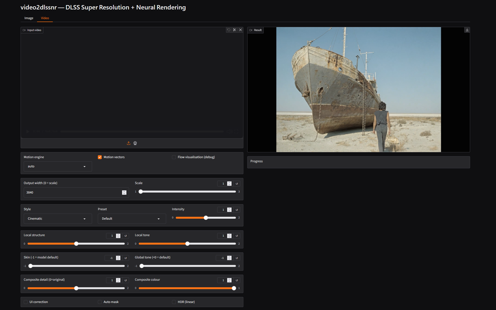
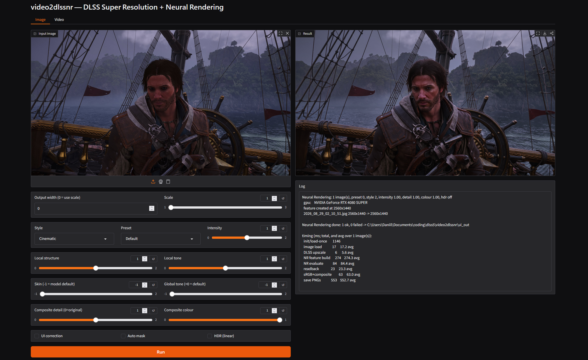
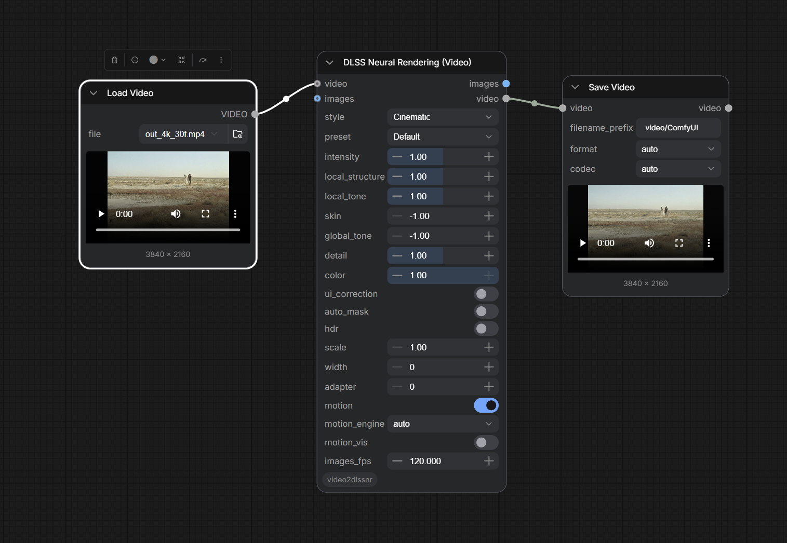
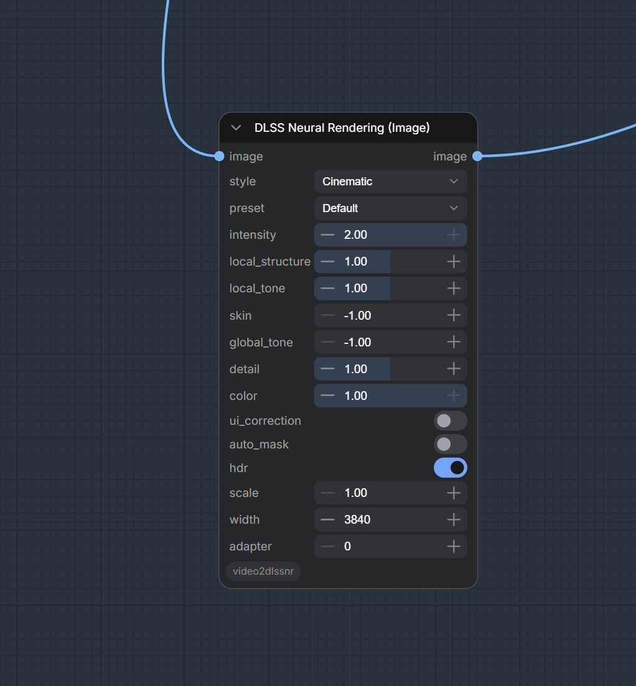

# video2dlssnr

   

> **Disclaimer.** video2dlssnr is not affiliated, associated, authorized, endorsed by, or in any way
> officially connected with NVIDIA Corporation or any of its subsidiaries or affiliates. All product
> and company names are the registered trademarks of their original owners; their use here is for
> identification only and does not imply endorsement. For research and educational use only, provided
> as-is, without warranty of any kind.

NVIDIA **DLSS Super Resolution** + **Neural Rendering** (DLSS 5, NGX feature 18) for images and
video on Windows / Direct3D 12. Use it through a **UI**, as **ComfyUI** nodes, or from the
**command line**.

The core is `video2dlssnr.exe` — **pure C++17 + D3D12**, no CMake, no vcpkg, no engine — a single
self-contained CLI (files in/out, or raw frames over stdin/stdout) that **embeds anywhere**. The UI,
the video script and the ComfyUI nodes are thin Python wrappers around it.

## Contents

- [Requirements](#requirements)
- [UI](#ui) — download, double-click, done
- [ComfyUI](#comfyui) — the same as custom nodes
- [Command line](#command-line) — a plain CLI that embeds anywhere: `video2dlssnr.exe` takes files
  in / files out or raw frames over stdin/stdout, `nr_video.py` wraps it for clips
- [How it works](#how-it-works) — the GPU pipeline, motion vectors, scene cuts
- [Build](#build)
- [Layout](#layout)

## Requirements

Barely anything: an NVIDIA RTX GPU on **driver 616.56+** and **Python 3**.

## UI

1. Download **`video2dlssnr_release.zip`** from the
   [latest release](https://github.com/DaniilSokolyuk/video2dlssnr/releases/latest) and unzip it
   anywhere.
2. Double-click **`start.bat`**. First run creates a virtual environment and installs the Python
   deps, then opens the app at <http://127.0.0.1:7860> with two tabs, **Image** and **Video**.

Drop a file, pick the style / intensity / output size, press **Run**. Video shows a live progress
line with fps; results land in `ui_out\`.

**Output size** is a preset (×1.5 / ×2 / ×3, 720p / 1080p / 1440p / 4K / 5K / 8K — fitted to the
source's aspect, portrait clips get the box turned) or **Custom** width × height / scale. **DLSS SR
preset** picks the Super Resolution model for the upscale: Default lets the driver choose (the
newest transformer), the CNN presets E / F give a smoother, calmer result after NR, J / K / L are
the other transformer models. The **Encoding**
block on the Video tab picks the **codec** (HEVC / H.264 / AV1 on NVENC, AV1 SVT / ProRes / FFV1
lossless on the CPU), the **container** (mp4 / mkv / mov / webm), the **quality** (constant-quality
presets Best … Low, or Custom with an explicit CQ / bitrate), **8 or 10-bit**, the NVENC preset and
what to do with the **audio** (copied unchanged when the container allows). The default — HEVC
10-bit, CQ 19 — gives a 4K clip roughly 15–30 Mbit/s depending on content. If the browser cannot
play the chosen format (HEVC, mkv, ProRes …) the UI shows a small H.264 preview copy; the file it
saved is the one offered for download and the one in `ui_out\`.

<p align="center">
  <a href="screens/1.png"></a>
  <a href="screens/2.png"></a>
</p>
<p align="center"><sub><b>Video</b> — a whole clip: motion engine, upscale factor, every NR knob · <b>Image</b> — a still, input/result side by side (click to enlarge)</sub></p>

## ComfyUI

> Do not download GitHub's automatically generated *Source code.zip* — take the ComfyUI asset from
> Releases.

1. Open [Releases](https://github.com/DaniilSokolyuk/video2dlssnr/releases) and download
   **`video2dlssnr-comfyui.zip`**.
2. Extract the contained `video2dlssnr` folder to:

   ```text
   ComfyUI\custom_nodes\video2dlssnr
   ```

3. Restart ComfyUI. The nodes find `video2dlssnr.exe` in `custom_nodes\video2dlssnr\bin\` on
   their own; to point them at another copy, set the environment variable `VIDEO2DLSSNR_EXE` to
   its full path. The nodes are under **video2dlssnr**:

| Node | In → Out | What it does |
|---|---|---|
| **DLSS Neural Rendering (Image)** | `IMAGE → IMAGE` | each image in the batch on its own (the Image tab) |
| **DLSS Neural Rendering (Video)** | `VIDEO` or `IMAGE → IMAGE + VIDEO` | a clip: frames stream through the tool with optical-flow **motion vectors** for temporal stability (the Video tab). Takes the core **Load Video** output directly (audio and frame rate are carried over) or an `IMAGE` batch from VideoHelperSuite, and returns both the frames and a ready `VIDEO` |
| **DLSS NR Runtime Check** | `→ STRING` | runs a tiny test job and reports whether Neural Rendering works here, plus the optical-flow backend in use — try it first if something is off |

Typical graphs:

- still: **Load Image → DLSS Neural Rendering (Image) → Save Image**
- clip, core nodes: **Load Video → DLSS Neural Rendering (Video) → Save Video**
- clip, VideoHelperSuite: **Load Video (Upload) → DLSS Neural Rendering (Video) → Video Combine**

<p align="center">
  <a href="screens/4.png"></a>
  <a href="screens/3.png"></a>
</p>
<p align="center"><sub><b>Load Video → DLSS Neural Rendering (Video) → Save Video</b> on a 4K clip · the <b>Image</b> node with its knobs (click to enlarge)</sub></p>

Both processing nodes expose the same knobs as the CLI — `style`, `preset`, `intensity`,
`local_structure`, `local_tone`, `skin`, `global_tone`, `detail`, `color`, `ui_correction`,
`auto_mask`, `hdr`, `scale` / `width` / `height` (one side pins the aspect, both pin the exact size,
`0` = use scale) — plus `adapter`
(which GPU); the Video node adds `motion`, `motion_engine` (`auto` / `nvof` / `lk`), `motion_vis`
and `images_fps` — frame-rate metadata for the `VIDEO` output when the input is an `IMAGE` batch
(it does not add frames; with a `VIDEO` input the source rate is used). The frame count in equals
the frame count out — to raise the frame rate, chain a frame-interpolation node (e.g. GIMM-VFI,
RIFE) after it.

Frames travel to the tool as raw RGBA over a pipe and come back the same way — no ffmpeg, no temp
files — and a driver hiccup takes down the helper process, not ComfyUI. Nodes need nothing beyond
what ComfyUI already ships (torch, numpy, Pillow).

## Command line

`video2dlssnr.exe` is a self-contained command-line tool with no runtime dependencies beyond the
NVIDIA driver: images go in and out as files, video as raw RGBA frames over stdin/stdout
(`--nr-video`), progress on stderr. That makes it trivial to embed in any pipeline, script or app —
`nr_video.py` and the ComfyUI nodes are just two thin wrappers around it.

### Images — `video2dlssnr.exe`

```bat
:: Neural Rendering — add detail to an image (native resolution)
out\video2dlssnr.exe --nr-run --in photo.png --out nr_out
:: Neural Rendering + DLSS upscale — 2x, or pin one side and keep aspect
out\video2dlssnr.exe --nr-run --in photo.png --out nr_out --nr-scale 2
out\video2dlssnr.exe --nr-run --in photo.png --out nr_out --nr-width 3840

:: Super Resolution only — upscale an image, try a few presets
out\video2dlssnr.exe --in photo.png --out out --quality quality --preset default,E,K
```

Each image run writes, into `--out`: `<name>_nr.png` (result), and with `--nr-orig` / `--nr-diff`
also `<name>_orig.png` (input at the same size) and `<name>_nr_diff.png` (error map).

Upscaling runs real **DLSS Super Resolution** first (input → target), then NR at the target
size — the same order a game uses. `--nr-detail 0` returns the input untouched. JPEGs are turned
upright by their EXIF orientation tag first, so phone photos come out the way they were shot.

### Video — `nr_video.py`

`nr_video.py` is the one entry point for video. It streams a whole clip through the
same DLSS SR + Neural Rendering, keeps every frame on the GPU, and prints a live fps/ETA bar:

```
ffmpeg (decode) --raw rgba--> video2dlssnr --nr-video --raw rgba--> ffmpeg (NVENC + audio)
```

Nothing goes back to the CPU between decode and encode — see [How it works](#how-it-works).
The flags are named exactly like `video2dlssnr.exe` (`--nr-*`), so the same knobs carry over.

```bat
:: 4K, Cinematic, motion vectors on (default), UI correction off (default)
python nr_video.py --in clip.mp4 --out clip_4k.mp4 ^
    --nr-width 3840 --nr-style 2 --nr-intensity 1.0

:: 2x upscale instead of a fixed width; or fit inside a box keeping the aspect
python nr_video.py --in clip.mp4 --out clip_2x.mp4 --nr-scale 2
python nr_video.py --in clip.mp4 --out clip_uhd.mp4 --nr-fit 3840x2160

:: native resolution, NR only (no upscale)
python nr_video.py --in clip.mov --out clip_nr.mov

:: other formats: the container comes from the extension, the codec from --codec
python nr_video.py --in clip.mp4 --out clip.mkv --codec av1_nvenc --cq 24
python nr_video.py --in clip.mp4 --out clip.mov --codec prores --prores-profile hq
python nr_video.py --in clip.mp4 --out clip_master.mkv --codec ffv1     :: lossless RGB
python nr_video.py --in clip.mp4 --out clip_compat.mp4 --codec h264_nvenc --bit-depth 8

:: debug: write the motion-vector visualisation instead of the NR result
python nr_video.py --in clip.mp4 --out clip_flow.mp4 --nr-motion-vis
```

Encoding defaults to **constant quality** (`--cq 19`, lower = better), **10-bit** HEVC (less banding,
better compression; `--bit-depth 8` for old players), full colour tagging (bt709, or the source's own
matrix / primaries / transfer carried through) and proper chroma resampling. Give `--bitrate` to
target a fixed bitrate instead. Audio is copied unchanged whenever the container allows it, else
re-encoded (AAC, or Opus for webm). Sizes smaller than the source are done by ffmpeg after NR
(DLSS only enlarges); above 3× the tool chains DLSS passes.

Progress prints live, e.g. `[=====>  ] 95/124 (77%)  25.9 fps  ETA 00:01`, then a final line
with the steady-state GPU fps. `ffmpeg` / `ffprobe` are looked up in `out\`, then on `PATH`, then a
winget **Gyan.FFmpeg** install. ProRes is CPU-decoded (NVDEC can't); everything else decodes fine.

| Flag | Default | Meaning |
|---|---|---|
| `--in <file>` | — | source clip |
| `--out <file>` | — | output clip; `.mp4` / `.mkv` / `.mov` / `.webm` picks the container |
| `--nr-width <px>` | — | output width, height by aspect (DLSS upscales to it) |
| `--nr-height <px>` | — | output height, width by aspect; with `--nr-width`: the exact size |
| `--nr-fit <WxH>` | — | fit inside the box keeping the aspect (portrait sources get it turned) |
| `--nr-scale <f>` | 1.0 | upscale factor when width/height unset (1.0 = native) |
| `--nr-sr-preset <p>` | `default` | DLSS Super Resolution model for the upscale: `default` (driver picks per mode), `E` CNN (DLSS 3.7 default), `F` CNN (Ultra Performance / DLAA), `J` DLSS 4 transformer (first), `K` DLSS 4 transformer (default), `L` / `M` DLSS 4.5 transformer (newest); any letter `A`..`O` is accepted |
| `--nr-style <0-2>` | 0 | NR style: 0 Default, 1 Natural, 2 Cinematic |
| `--nr-preset <0-3>` | 0 | NR render preset |
| `--nr-intensity <f>` | 1.0 | NR intensity (0–2) |
| `--nr-local-structure <f>` | 1.0 | local structure strength (0–2) |
| `--nr-local-tone <f>` | 1.0 | local tone strength (0–2) |
| `--nr-skin <f>` | -1.0 | skin structure strength (−1 = model default) |
| `--nr-global-tone <f>` | -1.0 | global tone strength (<0 = model default) |
| `--nr-detail <f>` | 1.0 | composite strength: 0 = original, 1 = full NR |
| `--nr-color <f>` | 1.0 | 0 = keep original hue, 1 = NR colour |
| `--nr-hdr` | off | feed linear light instead of the sRGB proxy |
| `--nr-ui-correction <0\|1>` | 0 | NR UI correction (off — no game UI) |
| `--nr-auto-mask` | off | NR automatic mask |
| `--nr-motion <0\|1>` | 1 | optical-flow motion vectors for NR (temporal stability) |
| `--nr-motion-engine <e>` | `auto` | flow backend: `auto` (NVOFA else LK), `nvof`, `lk` |
| `--nr-motion-vis` | off | output the flow visualisation instead of NR (debug) |
| `--frames <n>` | all | cap the number of frames processed |
| `--adapter <i>` | fastest | DXGI adapter index (which GPU) |
| `--codec <name>` | `hevc_nvenc` | `hevc_nvenc` / `h264_nvenc` / `av1_nvenc` (GPU); `av1_svt` (CPU AV1); `prores` (`.mov` / `.mkv`); `ffv1` (lossless RGB, `.mkv`) |
| `--cq <n>` | 19 | constant-quality target, lower = better: 15 near-transparent, 19 high, 23 medium, 28 small (`crf` for `av1_svt`; ignored by prores / ffv1) |
| `--bitrate <kbps>` | 0 | target bitrate instead of `--cq` (0 = use `--cq`) |
| `--bit-depth <8\|10>` | 10 | 10 = less banding and better compression; 8 = maximum compatibility (`h264_nvenc` is always 8) |
| `--enc-preset <p>` | `p5` | NVENC preset, `p1` (fast) .. `p7` (quality) |
| `--multipass <m>` | `qres` | NVENC two-pass mode: `disabled` / `qres` / `fullres` |
| `--sw-preset <n>` | 6 | `av1_svt` speed preset, 0 (slow) .. 13 (fast) |
| `--prores-profile <p>` | `hq` | `proxy` / `lt` / `standard` / `hq` / `4444` / `4444xq` |
| `--audio <mode>` | `auto` | `auto` (copy when the container allows, else re-encode) / `copy` / `aac` / `opus` / `flac` / `pcm` / `none` |
| `--audio-bitrate <kbps>` | 192 | for `aac` / `opus` |
| `--dry-run` | off | print the decode / tool / encode commands and exit |

### All arguments

#### Common

| Flag | Default | Meaning |
|---|---|---|
| `--in <path>` | — | source image, or a folder (Neural Rendering) |
| `--out <dir>` | `out` / `nr_out` | output directory |
| `--adapter <i>` | fastest | DXGI adapter index |
| `--json <file>` | `<out>/results.json` | machine-readable results (SR) |
| `--verbose`, `-v` | off | print the full NGX log |
| `--debug-layer` | off | enable the D3D12 debug layer |
| `--help` | | full option list |

#### Neural Rendering

`--nr-run` selects it. Model parameters are latched when the feature is created:

| Flag | Range | Default | Meaning |
|---|---|---|---|
| `--nr-preset <n>` | 0–3 | 0 | render preset: 0 Default, 1/2/3 Preset 1..3 |
| `--nr-style <n>` | 0–2 | 0 | **0 Default**, **1 Natural** (gentler, keeps skin tone), **2 Cinematic** (less shine) |
| `--nr-intensity <f>` | 0.0–2.0 | 1.0 | overall detail strength fed to the model |
| `--nr-local-structure <f>` | 0.0–2.0 | 1.0 | local structure strength |
| `--nr-local-tone <f>` | 0.0–2.0 | 1.0 | local tone strength |
| `--nr-skin <f>` | -1.0–2.0 | model default | skin structure strength (-1 or below = leave at the model's default) |
| `--nr-global-tone <f>` | 0.0–2.0 | model default | global tone strength (below 0 = leave at default) |
| `--nr-auto-mask` | on/off | off | the model's automatic mask |
| `--nr-ui-correction <0\|1>` | 0 or 1 | 1 | UI correction |

Upscaling (DLSS SR does the enlarge, NR the detail):

| Flag | Range | Default | Meaning |
|---|---|---|---|
| `--nr-sr-preset <p>` | `default`, `A`..`O` | `default` | DLSS SR model preset: `E`/`F` CNN, `J`/`K` DLSS 4 transformer, `L`/`M` DLSS 4.5 transformer |
| `--nr-scale <f>` | ~1.0–3.0 | 1.0 | output = input × f (DLSS SR upscales up to ~3×) |
| `--nr-width <px>` | ≥ input | — | set output width, height by aspect |
| `--nr-height <px>` | ≥ input | — | set output height, width by aspect |

Composition — how much of the model's output to keep (blended over the original on the CPU):

| Flag | Range | Default | Meaning |
|---|---|---|---|
| `--nr-detail <f>` | 0.0–2.0 | 1.0 | overall strength: **0 = the original**, 1 = full NR, >1 exaggerates |
| `--nr-color <f>` | 0.0–1.0 | 1.0 | 0 = keep the original hue (NR luma only), 1 = adopt the model's colour |
| `--nr-hdr` | on/off | off | feed linear light instead of the default sRGB-encoded proxy |

#### Super Resolution

| Flag | Default | Meaning |
|---|---|---|
| `--quality <list>` | `quality` | `dlaa,ultraquality,quality,balanced,performance,ultraperformance` or `all` |
| `--preset <list>` | `default,J,K` | `A`..`O`, `default`, or `all` |
| `--frames <n>` | 32 | accumulation passes per run |
| `--phases <n>` | auto | jitter sequence length |
| `--filter <mode>` | point | downsample filter: `point`, `bilinear`, `tent`, `lanczos` |
| `--filter-space <s>` | linear | `linear` or `display` |
| `--jitter-sign <s>` | auto | `auto`, `++`, `+-`, `-+`, `--` |
| `--hdr` | off | feed linear colour and set the DLSS HDR flag |
| `--no-auto-exposure` | off | supply a constant exposure texture (only affects `--hdr`) |
| `--alpha` | off | enable DLSS alpha upscaling |
| `--depth <v>` | 0.5 | constant depth written to the depth input |
| `--png16` | off | write 16-bit PNGs |
| `--save-lr` | off | also write the low-res input frame |
| `--no-diff` | off | skip the diff error map |
| `--diff-gain <f>` | 8 | error-map amplification |
| `--metrics-only` | off | measure without writing images (batch sweeps) |

#### Diagnostics

| Flag | Meaning |
|---|---|
| `--probe-nr` | try to create the NR feature and report where it stops; needs no image |
| `--probe-sl` | drive Streamline and report whether it sees DLSS-NR as supported |
| `--nr-in <WxH>` / `--nr-out <WxH>` | probe input / output size |
| `--sl-feature <id>` | Streamline feature id to probe (default 1004 = DLSS-NR) |

## How it works

Everything runs on the GPU:

```
ffmpeg decode → DLSS upscale → optical flow (motion vectors) → Neural Rendering → composite → ffmpeg encode (NVENC / CPU)
```

DLSS SR upscales first (input → target), then Neural Rendering adds detail at the target size — the
same order a game uses. NR is temporal, so per-pixel **motion vectors** are estimated by optical
flow: hardware **NVOFA** if present, else a compute-shader **Lucas–Kanade** fallback
(`--nr-motion-engine`). A scene-cut check resets history on cuts; `--nr-motion-vis` dumps the flow
field for debugging. Between decode and encode nothing goes back to the CPU — a compute shader
composites the result over the original and packs the 8-bit frame.

## Build

Needs Visual Studio 2022+ with the **C++ x64 toolset**. No CMake, no vcpkg.

The NGX headers and `stb` are vendored, but the proprietary **NGX import library is not** (it is
gitignored). Supply it before building — it is required at link time (the tool resolves the
`NVSDK_NGX_D3D12_*` symbols from it; at runtime everything goes through the driver's `_nvngx.dll`):

1. Get the **DLSS SDK** from <https://github.com/NVIDIA/DLSS> (`lib/Windows_x86_64/x86_64/`).
2. Copy into `third_party/nvngx/lib/`:
   - `nvsdk_ngx_d.lib` — needed for the **release** build,
   - `nvsdk_ngx_d_dbg.lib` — only for the **debug** build.

Then run from a normal terminal (build.bat finds the MSVC toolchain via vswhere):

```bat
build.bat            :: release
build.bat debug      :: debug
```

Produces `out\video2dlssnr.exe`, the forwarder `out\nvngx.dll_dlssnr.dll`, and the test binary
`out\video2dlssnr_tests.exe`. (build.bat errors out with `missing ...nvsdk_ngx_d.lib` if step 2 was
skipped.)

### Runtime libraries

The `.lib` above is only for linking. To actually **run** the built `video2dlssnr.exe`, put these
into `out\` next to it yourself:

- **`nvngx_dlssnr.dll`** — DLSS Neural Rendering (feature 18).
- **`nvngx_dlss.dll`** — DLSS Super Resolution (the upscaler).
- **`ffmpeg.exe`** + **`ffprobe.exe`** — video only. `nr_video.py` looks in `out\` first, then `PATH`.

Both NVIDIA DLLs are proprietary and loaded locally, not from the driver store. Get builds that run
on your GPU from your NVIDIA driver package or the DLSS SDK. Without `nvngx_dlss.dll` the upscale
fails with `UnableToInitializeFeature (0xBAD0000B)`: video errors out and image mode silently falls
back to a plain bilinear resize. For ffmpeg, any small static build with NVENC works.

## Layout

```
app.py         Gradio UI (Image / Video tabs); start.bat launches it in a venv
nr_video.py    video entry point (ffmpeg <-> video2dlssnr streaming)
comfyui/       ComfyUI custom nodes (DLSS NR Image / Video / Runtime Check)
src/           image I/O + metrics, D3D12 context, NGX wrapper, DLSS SR, DLSS-NR, CLI, main
forwarder/     the nvngx.dll_dlssnr.dll caller-gate shim
third_party/   NGX + Optical Flow SDK headers, stb single-header libs
build.bat      MSVC build of the tool, the forwarder and the tests
```
